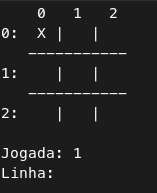
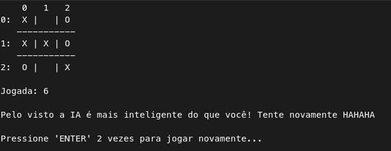

# Tic Tac Toe for Terminal with AI
## Introdução
### Este jogo é um jogo da velha para você jogar contra uma IA que utiliza do algoritmo Minimax para decidir qual jogada ela vai fazer para poder te derrotar
> O programa está em português, porém o código está em inglês

## Como utilizar no seu terminal?
### Instalando o jogo no seu terminal
```bash
$ git clone https://github.com/JotahIvo/tic-tac-toe-for-terminal-with-IA.git
$ cd tic-tac-toe-for-terminal-with-IA
```
### Executando o jogo
```bash
$ python main.py
```
---
Este jogo da velha é igual a todos que você brincava na sua infância...

>Você joga com o **O** e a IA joga com o **X**.

>A **IA** joga primeiro.

>Para você fazer sua jogada deve escolher a **linha** e a **coluna** em que deseja inserir o O.

>Para **ganhar** você deve preencher uma linha, coluna ou diagonal com O.

>Para **perder** a IA deve preencher uma linha, coluna ou diagonal com X.

>CAso nada disso aconteça, temos empate.

Interface do jogo:



Exemplo de quando o jogo termina:

